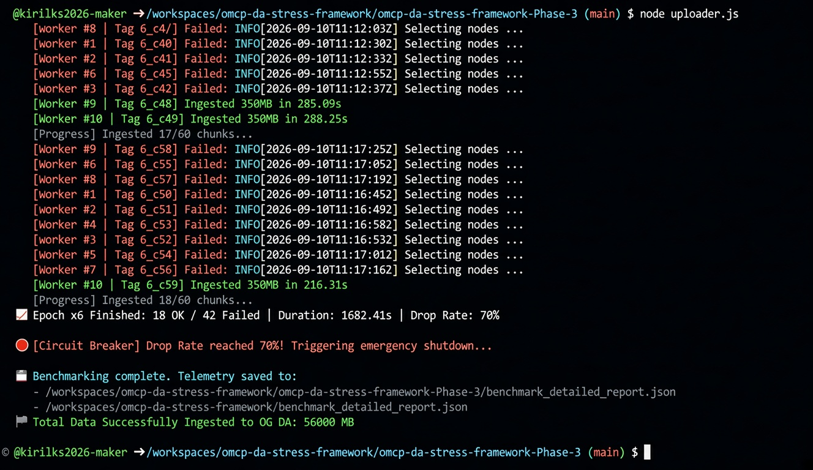

# 0G DA Ingestion Bottleneck & Storage Node Saturation Report (Phase 3)

## Summary
* **Timestamp**: 2026-09-10T09:36:27.741Z
* **Framework Phase**: Phase-3 (Direct DA Ingestion Marathon)
* **Chunk Size**: 350 MB
* **Total Payload Uploaded**: 56,000 MB (56 GB)
* **Total Transactions**: 210 (160 Successful, 50 Failed)
* **Overall Failure Rate**: ~23.8%

---

## Epoch Metrics Breakdown

| Epoch | Chunks | Duration (s) | Successful | Failed | Drop Rate (%) |
|---|---|---|---|---|---|
| 1 | 10 | 214.33 | 10 | 0 | 0.0% |
| 2 | 20 | 480.15 | 20 | 0 | 0.0% |
| 3 | 30 | 670.11 | 30 | 0 | 0.0% |
| 4 | 40 | 1394.64 | 40 | 0 | 0.0% |
| 5 | 50 | 1837.92 | 42 | 8 | 16.0% |
| 6 | 60 | 1682.41 | 18 | 42 | 70.0% |

---

## Technical Analysis & Observations

1. **Scalability Ceiling (Epochs 1–4)**:
   * System performance was stable up to Epoch 4 (40 concurrent chunks / 14 GB payload), maintaining a 0% drop rate.
   * Average processing time per chunk steadily scaled from ~170s in Epoch 1 to ~320s in Epoch 4 due to rising node ingestion load.

2. **Degradation Point (Epoch 5)**:
   * At 50 concurrent chunks (17.5 GB payload), initial worker failures appeared (16% drop rate).
   * Failures concentrated heavily on lower-indexed workers (Workers 1–4).

3. **Node Selection Exhaustion (Epoch 6)**:
   * Severe performance degradation observed in Epoch 6 (70% drop rate).
   * **Root Cause Error**: Ingestion client stalled during node discovery/selection (`INFO Selecting nodes ...`), resulting in timeouts.
   * Out of 10 parallel workers, only Worker 10 maintained consistent write access, indicating severe storage/DA node saturation and lockouts across the cluster.
     
---

## Execution Logs & Circuit Breaker Proof

